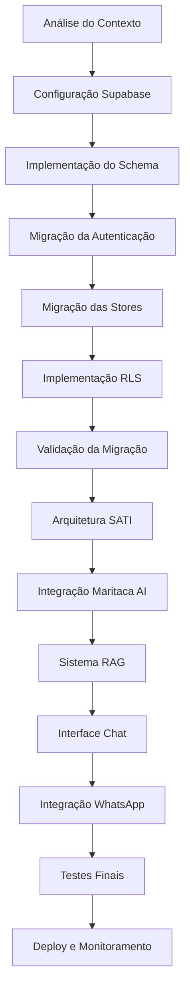

# Metodologia LLM para Migração Supabase e Implementação SATI

## 📋 Visão Geral

Esta documentação foi criada especificamente para guiar uma LLM (Large Language Model) no processo de migração do projeto StayFocus para Supabase e implementação da assistente virtual SATI. A abordagem metodológica fragmenta o processo em subtarefas organizadas e sequenciais, seguindo princípios de desenvolvimento ágil e boas práticas de engenharia de software.

## 🎯 Objetivos da Metodologia

1. **Guiar uma LLM** através de um processo complexo de migração e desenvolvimento
2. **Fragmentar tarefas complexas** em subtarefas executáveis e verificáveis
3. **Estabelecer critérios claros** de validação para cada etapa
4. **Minimizar riscos** através de validação incremental
5. **Manter qualidade** através de boas práticas e testes

## 📁 Estrutura da Documentação

### Documentos Principais

1. **[01-abordagem-geral.md](./01-abordagem-geral.md)** - Estratégia metodológica geral
2. **[02-pre-requisitos.md](./02-pre-requisitos.md)** - Preparação e configuração inicial
3. **[03-analise-contexto.md](./03-analise-contexto.md)** - Análise do código atual
4. **[04-migracao-supabase.md](./04-migracao-supabase.md)** - Processo de migração para Supabase
5. **[05-implementacao-sati.md](./05-implementacao-sati.md)** - Desenvolvimento da assistente SATI
6. **[06-validacao-testes.md](./06-validacao-testes.md)** - Validação e testes
7. **[07-checklist-execucao.md](./07-checklist-execucao.md)** - Checklist completo de execução

### Templates de Prompts

8. **[prompts-template.md](./prompts-template.md)** - Templates de prompts para LLM com metodologia TDD
9. **[prompts-especificos.md](./prompts-especificos.md)** - Prompts específicos prontos para uso

### Subdocumentos por Fase

#### Migração Supabase
- `migracao/01-configuracao-inicial.md` - Configuração inicial do Supabase
- `migracao/02-migracao-tasks.md` - Migração do store de tarefas
- `migracao/03-migracao-sessions.md` - Migração das sessões Pomodoro
- `migracao/04-migracao-settings.md` - Migração das configurações do usuário

#### Implementação SATI
- `sati/01-arquitetura-sati.md` - Arquitetura base do SATI
- `sati/02-sistema-rag.md` - Sistema RAG com busca vetorial
- `sati/03-analise-contexto-padroes.md` - Análise de contexto e padrões
- `sati/04-interface-usuario.md` - Interface de usuário e chat

## 🚀 Como Usar Esta Documentação

### Para uma LLM em Execução:

1. **Inicie sempre pela [Abordagem Geral](./01-abordagem-geral.md)**
2. **Verifique os [Pré-requisitos](./02-pre-requisitos.md)** antes de começar
3. **Use os [Templates de Prompts](./prompts-template.md)** para comunicação eficiente
4. **Consulte [Prompts Específicos](./prompts-especificos.md)** para tarefas comuns
5. **Execute as tarefas em ordem sequencial**
6. **Valide cada etapa** antes de prosseguir
7. **Use os checklists** para verificar completude
6. **Documente problemas e soluções** encontrados

### Princípios de Execução:

- ✅ **Uma tarefa por vez** - Execute completamente antes de prosseguir
- ✅ **Validação incremental** - Teste cada mudança imediatamente
- ✅ **Backup de segurança** - Sempre mantenha versões funcionais
- ✅ **Documentação contínua** - Registre decisões e mudanças
- ✅ **Monitoramento de dependências** - Identifique impactos entre componentes

## 🔄 Fluxo de Execução Recomendado

## ⚠️ Considerações Importantes

### Para a LLM:
- **Sempre leia o contexto completo** antes de fazer alterações
- **Use as ferramentas de busca** para entender o código existente
- **Valide mudanças** executando testes após cada modificação
- **Mantenha backup** de configurações funcionais
- **Documente decisões** tomadas durante o processo

### Pontos Críticos:
- **Migração de dados** - Nunca perca dados do usuário
- **Autenticação** - Mantenha compatibilidade com sessões existentes
- **Performance** - Monitore tempos de resposta durante migração
- **Segurança** - Implemente RLS corretamente desde o início

## 📊 Métricas de Sucesso

- ✅ Migração completa sem perda de funcionalidades
- ✅ Tempo de resposta < 2s para operações CRUD
- ✅ SATI respondendo em < 5s
- ✅ Cobertura de testes > 80%
- ✅ Zero vulnerabilidades de segurança críticas
- ✅ Documentação 100% atualizada

## 🆘 Suporte e Troubleshooting

Em caso de problemas:
1. Consulte o [checklist de execução](./07-checklist-execucao.md)
2. Verifique logs detalhados de cada operação
3. Execute testes de regressão
4. Consulte documentação oficial do Supabase e Maritaca AI
5. Revert para última versão funcional se necessário

---

**Próximo:** [01 - Abordagem Geral](./01-abordagem-geral.md)
