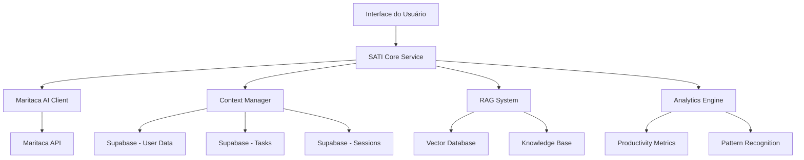

# Arquitetura SATI - Sistema de Assistente de Tarefas Inteligente

## Visão Geral
O SATI é um assistente de IA integrado ao StayFocus que utiliza Maritaca AI para fornecer sugestões inteligentes, análise de produtividade e suporte contextual ao usuário.

## Arquitetura Geral



## Componentes Principais

### 1. SATI Core Service
```typescript
// src/services/satiService.ts
import { MaritacaClient } from './maritacaClient';
import { ContextManager } from './contextManager';
import { RAGSystem } from './ragSystem';
import { AnalyticsEngine } from './analyticsEngine';

export interface SATIMessage {
  id: string;
  type: 'user' | 'assistant';
  content: string;
  timestamp: Date;
  context?: any;
  metadata?: {
    confidence?: number;
    sources?: string[];
    actionable?: boolean;
  };
}

export interface SATIContext {
  currentTask?: Task;
  recentSessions?: PomodoroSession[];
  userSettings?: UserSettings;
  productivityMetrics?: ProductivityMetrics;
  timeOfDay?: string;
  dayOfWeek?: string;
}

export class SATIService {
  private maritaca: MaritacaClient;
  private contextManager: ContextManager;
  private ragSystem: RAGSystem;
  private analytics: AnalyticsEngine;

  constructor() {
    this.maritaca = new MaritacaClient();
    this.contextManager = new ContextManager();
    this.ragSystem = new RAGSystem();
    this.analytics = new AnalyticsEngine();
  }

  async processMessage(
    message: string,
    userId: string,
    sessionId?: string
  ): Promise<SATIMessage> {
    try {
      // 1. Preparar contexto
      const context = await this.contextManager.buildContext(userId);
      
      // 2. Enriquecer com RAG
      const ragContext = await this.ragSystem.retrieveRelevantContext(message, context);
      
      // 3. Analisar padrões
      const insights = await this.analytics.analyzeUserPatterns(userId, context);
      
      // 4. Gerar resposta com Maritaca
      const response = await this.maritaca.generateResponse({
        message,
        context: { ...context, ...ragContext },
        insights,
        userId
      });

      // 5. Salvar interação
      await this.saveInteraction(userId, message, response, sessionId);

      return {
        id: generateId(),
        type: 'assistant',
        content: response.content,
        timestamp: new Date(),
        context: response.context,
        metadata: {
          confidence: response.confidence,
          sources: response.sources,
          actionable: response.actionable
        }
      };
    } catch (error) {
      console.error('Erro no processamento SATI:', error);
      throw error;
    }
  }

  async generateProactiveSuggestion(userId: string): Promise<SATIMessage | null> {
    try {
      const context = await this.contextManager.buildContext(userId);
      const patterns = await this.analytics.analyzeUserPatterns(userId, context);
      
      // Verificar se há padrões que justifiquem uma sugestão
      if (!this.shouldGenerateProactiveSuggestion(patterns, context)) {
        return null;
      }

      const suggestion = await this.maritaca.generateProactiveSuggestion({
        context,
        patterns,
        userId
      });

      if (suggestion) {
        await this.saveInteraction(userId, '[PROACTIVE]', suggestion);
        
        return {
          id: generateId(),
          type: 'assistant',
          content: suggestion.content,
          timestamp: new Date(),
          metadata: {
            confidence: suggestion.confidence,
            actionable: true
          }
        };
      }

      return null;
    } catch (error) {
      console.error('Erro na sugestão proativa:', error);
      return null;
    }
  }

  async analyzeProductivity(userId: string, period: 'day' | 'week' | 'month'): Promise<any> {
    try {
      const context = await this.contextManager.buildContext(userId);
      const metrics = await this.analytics.getProductivityMetrics(userId, period);
      
      const analysis = await this.maritaca.analyzeProductivity({
        metrics,
        context,
        period,
        userId
      });

      return analysis;
    } catch (error) {
      console.error('Erro na análise de produtividade:', error);
      throw error;
    }
  }

  private shouldGenerateProactiveSuggestion(patterns: any, context: SATIContext): boolean {
    // Regras para determinar quando gerar sugestões proativas
    const now = new Date();
    const hour = now.getHours();
    
    // Não sugerir muito cedo ou muito tarde
    if (hour < 8 || hour > 22) return false;
    
    // Verificar se o usuário está em uma sessão ativa
    if (context.currentTask && patterns.sessionActive) return false;
    
    // Verificar padrões de produtividade baixa
    if (patterns.productivityTrend === 'declining') return true;
    
    // Verificar se há tarefas pendentes há muito tempo
    if (patterns.overdueTasks && patterns.overdueTasks.length > 0) return true;
    
    // Verificar padrões de pausa longa
    if (patterns.lastSessionEnd && (now.getTime() - patterns.lastSessionEnd.getTime()) > 3600000) {
      return true; // 1 hora sem atividade
    }
    
    return false;
  }

  private async saveInteraction(
    userId: string,
    userMessage: string,
    assistantResponse: any,
    sessionId?: string
  ): Promise<void> {
    try {
      const { error } = await supabase
        .from('sati_interactions')
        .insert([{
          user_id: userId,
          session_id: sessionId,
          user_message: userMessage,
          assistant_response: assistantResponse.content,
          context_data: assistantResponse.context,
          confidence_score: assistantResponse.confidence,
          created_at: new Date().toISOString()
        }]);

      if (error) throw error;
    } catch (error) {
      console.error('Erro ao salvar interação:', error);
    }
  }
}
```

### 2. Maritaca AI Client
```typescript
// src/services/maritacaClient.ts
export interface MaritacaRequest {
  message: string;
  context: SATIContext;
  insights?: any;
  userId: string;
}

export interface MaritacaResponse {
  content: string;
  confidence: number;
  sources?: string[];
  context?: any;
  actionable?: boolean;
}

export class MaritacaClient {
  private apiKey: string;
  private baseURL: string;

  constructor() {
    this.apiKey = process.env.REACT_APP_MARITACA_API_KEY || '';
    this.baseURL = 'https://chat.maritaca.ai/api';
  }

  async generateResponse(request: MaritacaRequest): Promise<MaritacaResponse> {
    try {
      const prompt = this.buildPrompt(request);
      
      const response = await fetch(`${this.baseURL}/chat`, {
        method: 'POST',
        headers: {
          'Authorization': `Bearer ${this.apiKey}`,
          'Content-Type': 'application/json'
        },
        body: JSON.stringify({
          model: 'sabia-2-medium',
          messages: [
            {
              role: 'system',
              content: this.getSystemPrompt()
            },
            {
              role: 'user',
              content: prompt
            }
          ],
          temperature: 0.7,
          max_tokens: 500
        })
      });

      if (!response.ok) {
        throw new Error(`Maritaca API error: ${response.status}`);
      }

      const data = await response.json();
      
      return {
        content: data.choices[0].message.content,
        confidence: this.calculateConfidence(data),
        actionable: this.isActionable(data.choices[0].message.content)
      };
    } catch (error) {
      console.error('Erro na API Maritaca:', error);
      throw error;
    }
  }

  async generateProactiveSuggestion(request: {
    context: SATIContext;
    patterns: any;
    userId: string;
  }): Promise<MaritacaResponse | null> {
    try {
      const prompt = this.buildProactivePrompt(request);
      
      const response = await this.generateResponse({
        message: prompt,
        context: request.context,
        userId: request.userId
      });

      // Filtrar sugestões de baixa qualidade
      if (response.confidence < 0.6) {
        return null;
      }

      return response;
    } catch (error) {
      console.error('Erro na sugestão proativa:', error);
      return null;
    }
  }

  async analyzeProductivity(request: {
    metrics: any;
    context: SATIContext;
    period: string;
    userId: string;
  }): Promise<any> {
    try {
      const prompt = this.buildProductivityPrompt(request);
      
      const response = await this.generateResponse({
        message: prompt,
        context: request.context,
        userId: request.userId
      });

      return {
        ...response,
        insights: this.extractInsights(response.content),
        recommendations: this.extractRecommendations(response.content)
      };
    } catch (error) {
      console.error('Erro na análise de produtividade:', error);
      throw error;
    }
  }

  private getSystemPrompt(): string {
    return `
Você é SATI, um assistente de produtividade inteligente integrado ao aplicativo StayFocus.

PERSONALIDADE:
- Amigável, motivador e focado em resultados
- Comunica-se de forma clara e objetiva
- Oferece sugestões práticas e acionáveis
- Respeita o contexto e preferências do usuário

FUNCIONALIDADES:
- Análise de padrões de produtividade
- Sugestões de otimização de tempo
- Identificação de distrações e obstáculos
- Recomendações personalizadas de técnicas Pomodoro
- Análise de tendências e progresso

DIRETRIZES:
- Sempre considere o contexto atual do usuário
- Forneça respostas concisas (máximo 3 parágrafos)
- Inclua pelo menos uma ação específica quando apropriado
- Use dados concretos quando disponíveis
- Seja encorajador, mas realista

LIMITAÇÕES:
- Não forneça conselhos médicos ou psicológicos
- Não acesse informações externas ao contexto fornecido
- Mantenha o foco em produtividade e gestão de tempo
    `;
  }

  private buildPrompt(request: MaritacaRequest): string {
    const { message, context, insights } = request;
    
    let prompt = `CONTEXTO DO USUÁRIO:\n`;
    
    if (context.currentTask) {
      prompt += `Tarefa atual: ${context.currentTask.title}\n`;
      prompt += `Categoria: ${context.currentTask.category}\n`;
      prompt += `Prioridade: ${context.currentTask.priority}\n`;
    }
    
    if (context.recentSessions && context.recentSessions.length > 0) {
      const completedToday = context.recentSessions.filter(s => 
        s.completed && isToday(new Date(s.started_at))
      ).length;
      prompt += `Sessões completadas hoje: ${completedToday}\n`;
    }
    
    if (context.productivityMetrics) {
      prompt += `Produtividade recente: ${context.productivityMetrics.weeklyAverage}%\n`;
    }
    
    if (insights) {
      prompt += `INSIGHTS IDENTIFICADOS:\n${JSON.stringify(insights, null, 2)}\n`;
    }
    
    prompt += `\nPERGUNTA/SOLICITAÇÃO: ${message}`;
    
    return prompt;
  }

  private buildProactivePrompt(request: {
    context: SATIContext;
    patterns: any;
    userId: string;
  }): string {
    const { context, patterns } = request;
    
    let prompt = `Analise os seguintes padrões do usuário e gere uma sugestão proativa útil:\n\n`;
    
    prompt += `PADRÕES IDENTIFICADOS:\n${JSON.stringify(patterns, null, 2)}\n\n`;
    
    if (context.currentTask) {
      prompt += `CONTEXTO ATUAL: Usuário tem uma tarefa ativa: ${context.currentTask.title}\n`;
    } else {
      prompt += `CONTEXTO ATUAL: Usuário não está em uma sessão ativa no momento\n`;
    }
    
    prompt += `Gere uma sugestão específica e acionável para melhorar a produtividade. Seja breve e direto.`;
    
    return prompt;
  }

  private buildProductivityPrompt(request: {
    metrics: any;
    context: SATIContext;
    period: string;
  }): string {
    const { metrics, context, period } = request;
    
    let prompt = `Analise as métricas de produtividade do período (${period}) e forneça insights:\n\n`;
    
    prompt += `MÉTRICAS:\n${JSON.stringify(metrics, null, 2)}\n\n`;
    
    if (context.userSettings) {
      prompt += `META DIÁRIA: ${context.userSettings.daily_goal_sessions} sessões\n`;
    }
    
    prompt += `Forneça:\n`;
    prompt += `1. Análise dos pontos fortes e fracos\n`;
    prompt += `2. Tendências identificadas\n`;
    prompt += `3. Recomendações específicas para melhoria\n`;
    
    return prompt;
  }

  private calculateConfidence(data: any): number {
    // Implementar lógica para calcular confiança baseada na resposta
    // Por enquanto, retorna um valor baseado no comprimento e estrutura
    const content = data.choices[0].message.content;
    
    if (content.length < 50) return 0.3;
    if (content.length > 300) return 0.9;
    
    // Verificar se contém sugestões específicas
    const hasActions = /\b(recomendo|sugiro|tente|faça|experimente)\b/i.test(content);
    
    return hasActions ? 0.8 : 0.6;
  }

  private isActionable(content: string): boolean {
    const actionWords = [
      'recomendo', 'sugiro', 'tente', 'faça', 'experimente',
      'considere', 'implemente', 'ajuste', 'modifique', 'pratique'
    ];
    
    return actionWords.some(word => 
      content.toLowerCase().includes(word.toLowerCase())
    );
  }

  private extractInsights(content: string): string[] {
    // Extrair insights da resposta usando regex ou parsing simples
    const insights = [];
    const lines = content.split('\n');
    
    for (const line of lines) {
      if (line.includes('insight') || line.includes('observo') || line.includes('identifiquei')) {
        insights.push(line.trim());
      }
    }
    
    return insights;
  }

  private extractRecommendations(content: string): string[] {
    const recommendations = [];
    const lines = content.split('\n');
    
    for (const line of lines) {
      if (line.includes('recomendo') || line.includes('sugiro') || line.match(/^\d+\./)) {
        recommendations.push(line.trim());
      }
    }
    
    return recommendations;
  }
}
```

## Schema do Banco de Dados

```sql
-- Tabela para armazenar interações com SATI
CREATE TABLE sati_interactions (
  id UUID DEFAULT gen_random_uuid() PRIMARY KEY,
  user_id UUID REFERENCES auth.users(id) ON DELETE CASCADE,
  session_id UUID, -- ID da sessão de chat (opcional)
  user_message TEXT NOT NULL,
  assistant_response TEXT NOT NULL,
  context_data JSONB,
  confidence_score FLOAT,
  feedback_rating INTEGER CHECK (feedback_rating >= 1 AND feedback_rating <= 5),
  feedback_comment TEXT,
  created_at TIMESTAMP WITH TIME ZONE DEFAULT NOW()
);

-- Tabela para conhecimento base do RAG
CREATE TABLE sati_knowledge_base (
  id UUID DEFAULT gen_random_uuid() PRIMARY KEY,
  title VARCHAR(255) NOT NULL,
  content TEXT NOT NULL,
  category VARCHAR(100),
  tags TEXT[],
  embedding VECTOR(1536), -- Para OpenAI embeddings
  metadata JSONB,
  created_at TIMESTAMP WITH TIME ZONE DEFAULT NOW(),
  updated_at TIMESTAMP WITH TIME ZONE DEFAULT NOW()
);

-- Tabela para sessões de chat
CREATE TABLE sati_chat_sessions (
  id UUID DEFAULT gen_random_uuid() PRIMARY KEY,
  user_id UUID REFERENCES auth.users(id) ON DELETE CASCADE,
  title VARCHAR(255),
  context_summary TEXT,
  started_at TIMESTAMP WITH TIME ZONE DEFAULT NOW(),
  ended_at TIMESTAMP WITH TIME ZONE,
  message_count INTEGER DEFAULT 0
);

-- Índices para performance
CREATE INDEX idx_sati_interactions_user_id ON sati_interactions(user_id);
CREATE INDEX idx_sati_interactions_session_id ON sati_interactions(session_id);
CREATE INDEX idx_sati_knowledge_base_category ON sati_knowledge_base(category);
CREATE INDEX idx_sati_knowledge_base_embedding ON sati_knowledge_base USING ivfflat (embedding vector_cosine_ops);
```

## Configuração de Segurança RLS

```sql
-- RLS para sati_interactions
ALTER TABLE sati_interactions ENABLE ROW LEVEL SECURITY;

CREATE POLICY "Users can view own SATI interactions" ON sati_interactions
  FOR SELECT USING (auth.uid() = user_id);

CREATE POLICY "Users can create own SATI interactions" ON sati_interactions
  FOR INSERT WITH CHECK (auth.uid() = user_id);

-- RLS para sati_chat_sessions
ALTER TABLE sati_chat_sessions ENABLE ROW LEVEL SECURITY;

CREATE POLICY "Users can manage own chat sessions" ON sati_chat_sessions
  FOR ALL USING (auth.uid() = user_id);

-- Knowledge base é read-only para usuários
ALTER TABLE sati_knowledge_base ENABLE ROW LEVEL SECURITY;

CREATE POLICY "Users can read knowledge base" ON sati_knowledge_base
  FOR SELECT TO authenticated USING (true);
```

## Integração com Interface

```typescript
// src/components/SATI/SATIChat.tsx
import React, { useState, useEffect } from 'react';
import { SATIService, SATIMessage } from '../../services/satiService';

export function SATIChat() {
  const [messages, setMessages] = useState<SATIMessage[]>([]);
  const [input, setInput] = useState('');
  const [loading, setLoading] = useState(false);
  const [sessionId] = useState(() => generateId());
  
  const satiService = new SATIService();

  const sendMessage = async () => {
    if (!input.trim() || loading) return;

    const userMessage: SATIMessage = {
      id: generateId(),
      type: 'user',
      content: input,
      timestamp: new Date()
    };

    setMessages(prev => [...prev, userMessage]);
    setInput('');
    setLoading(true);

    try {
      const userId = await getCurrentUserId();
      const response = await satiService.processMessage(input, userId, sessionId);
      setMessages(prev => [...prev, response]);
    } catch (error) {
      console.error('Erro ao enviar mensagem:', error);
      // Adicionar mensagem de erro
    } finally {
      setLoading(false);
    }
  };

  return (
    <div className="sati-chat">
      <div className="messages">
        {messages.map(message => (
          <div key={message.id} className={`message ${message.type}`}>
            <div className="content">{message.content}</div>
            <div className="timestamp">
              {message.timestamp.toLocaleTimeString()}
            </div>
          </div>
        ))}
      </div>
      
      <div className="input-area">
        <input
          value={input}
          onChange={(e) => setInput(e.target.value)}
          onKeyPress={(e) => e.key === 'Enter' && sendMessage()}
          placeholder="Como posso ajudar com sua produtividade?"
          disabled={loading}
        />
        <button onClick={sendMessage} disabled={loading || !input.trim()}>
          {loading ? 'Enviando...' : 'Enviar'}
        </button>
      </div>
    </div>
  );
}
```

## Métricas e Monitoramento

```typescript
// src/services/satiMetrics.ts
export class SATIMetrics {
  async trackInteraction(interaction: {
    userId: string;
    type: 'chat' | 'proactive' | 'analysis';
    duration: number;
    satisfaction?: number;
  }) {
    // Implementar tracking de métricas
  }

  async getUsageStatistics(userId: string) {
    const { data, error } = await supabase
      .from('sati_interactions')
      .select('*')
      .eq('user_id', userId);

    if (error) throw error;

    return {
      totalInteractions: data.length,
      averageConfidence: data.reduce((acc, i) => acc + i.confidence_score, 0) / data.length,
      mostCommonTopics: this.analyzeTopic(data),
      satisfactionRating: data
        .filter(i => i.feedback_rating)
        .reduce((acc, i) => acc + i.feedback_rating, 0) / data.filter(i => i.feedback_rating).length
    };
  }
}
```
