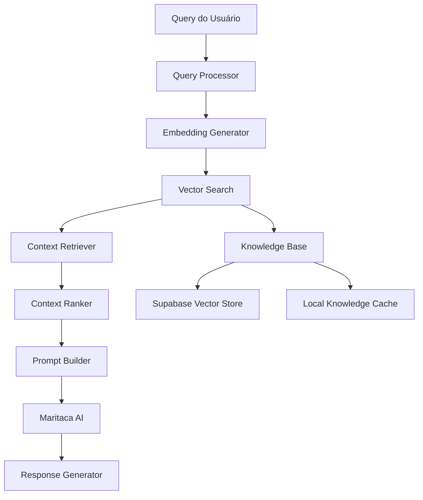

# Sistema RAG (Retrieval-Augmented Generation) para SATI

## Objetivo
Implementar um sistema RAG que permita ao SATI acessar conhecimento específico sobre produtividade, técnicas Pomodoro e melhores práticas para fornecer respostas mais precisas e contextuais.

## Arquitetura do Sistema RAG



## Implementação

### 1. Knowledge Base Setup
```typescript
// src/services/ragSystem.ts
import { supabase } from './supabaseClient';

export interface KnowledgeDocument {
  id: string;
  title: string;
  content: string;
  category: string;
  tags: string[];
  embedding?: number[];
  metadata?: any;
  createdAt: Date;
  updatedAt: Date;
}

export interface RAGContext {
  documents: KnowledgeDocument[];
  relevanceScores: number[];
  totalSources: number;
}

export class RAGSystem {
  private embeddings: EmbeddingService;
  private vectorStore: VectorStore;
  private cache: Map<string, RAGContext>;

  constructor() {
    this.embeddings = new EmbeddingService();
    this.vectorStore = new VectorStore();
    this.cache = new Map();
  }

  async retrieveRelevantContext(
    query: string,
    userContext: SATIContext,
    maxResults: number = 5
  ): Promise<RAGContext> {
    try {
      // Verificar cache primeiro
      const cacheKey = this.generateCacheKey(query, userContext);
      if (this.cache.has(cacheKey)) {
        return this.cache.get(cacheKey)!;
      }

      // 1. Gerar embedding da query
      const queryEmbedding = await this.embeddings.generateEmbedding(query);

      // 2. Expandir query com contexto do usuário
      const expandedQuery = this.expandQueryWithContext(query, userContext);
      const expandedEmbedding = await this.embeddings.generateEmbedding(expandedQuery);

      // 3. Buscar documentos similares
      const similarDocs = await this.vectorStore.search(
        queryEmbedding,
        expandedEmbedding,
        maxResults
      );

      // 4. Filtrar por relevância
      const relevantDocs = this.filterByRelevance(similarDocs, userContext);

      // 5. Rankear resultados
      const rankedDocs = this.rankDocuments(relevantDocs, query, userContext);

      const ragContext: RAGContext = {
        documents: rankedDocs.map(doc => doc.document),
        relevanceScores: rankedDocs.map(doc => doc.score),
        totalSources: rankedDocs.length
      };

      // Cache do resultado
      this.cache.set(cacheKey, ragContext);
      
      return ragContext;
    } catch (error) {
      console.error('Erro no sistema RAG:', error);
      return { documents: [], relevanceScores: [], totalSources: 0 };
    }
  }

  async addKnowledgeDocument(document: Omit<KnowledgeDocument, 'id' | 'embedding' | 'createdAt' | 'updatedAt'>): Promise<void> {
    try {
      // 1. Gerar embedding do conteúdo
      const embedding = await this.embeddings.generateEmbedding(
        `${document.title} ${document.content}`
      );

      // 2. Preparar documento para inserção
      const docToInsert = {
        title: document.title,
        content: document.content,
        category: document.category,
        tags: document.tags,
        embedding,
        metadata: document.metadata || {},
        created_at: new Date().toISOString(),
        updated_at: new Date().toISOString()
      };

      // 3. Inserir no banco de dados
      const { error } = await supabase
        .from('sati_knowledge_base')
        .insert([docToInsert]);

      if (error) throw error;

      // 4. Invalidar cache relacionado
      this.invalidateRelatedCache(document.category, document.tags);

      console.log('Documento adicionado à base de conhecimento:', document.title);
    } catch (error) {
      console.error('Erro ao adicionar documento:', error);
      throw error;
    }
  }

  async updateKnowledgeDocument(id: string, updates: Partial<KnowledgeDocument>): Promise<void> {
    try {
      let updateData: any = {
        ...updates,
        updated_at: new Date().toISOString()
      };

      // Regerar embedding se conteúdo foi alterado
      if (updates.content || updates.title) {
        const doc = await this.getDocument(id);
        const newContent = `${updates.title || doc.title} ${updates.content || doc.content}`;
        updateData.embedding = await this.embeddings.generateEmbedding(newContent);
      }

      const { error } = await supabase
        .from('sati_knowledge_base')
        .update(updateData)
        .eq('id', id);

      if (error) throw error;

      // Invalidar cache
      this.cache.clear();
    } catch (error) {
      console.error('Erro ao atualizar documento:', error);
      throw error;
    }
  }

  private expandQueryWithContext(query: string, context: SATIContext): string {
    let expandedQuery = query;

    // Adicionar contexto da tarefa atual
    if (context.currentTask) {
      expandedQuery += ` contexto: ${context.currentTask.category} ${context.currentTask.priority}`;
    }

    // Adicionar padrões de sessões recentes
    if (context.recentSessions && context.recentSessions.length > 0) {
      const avgDuration = context.recentSessions.reduce((acc, s) => acc + s.duration, 0) / context.recentSessions.length;
      expandedQuery += ` duração média: ${Math.round(avgDuration / 60)} minutos`;
    }

    // Adicionar contexto temporal
    const now = new Date();
    const hour = now.getHours();
    
    if (hour < 12) {
      expandedQuery += ' manhã produtividade';
    } else if (hour < 18) {
      expandedQuery += ' tarde foco';
    } else {
      expandedQuery += ' noite planejamento';
    }

    return expandedQuery;
  }

  private filterByRelevance(
    documents: Array<{ document: KnowledgeDocument; score: number }>,
    context: SATIContext,
    threshold: number = 0.7
  ): Array<{ document: KnowledgeDocument; score: number }> {
    return documents.filter(doc => {
      // Filtro básico por score
      if (doc.score < threshold) return false;

      // Filtro por categoria se há tarefa atual
      if (context.currentTask && context.currentTask.category) {
        const categoryMatch = doc.document.tags.includes(context.currentTask.category.toLowerCase()) ||
                            doc.document.category === context.currentTask.category.toLowerCase();
        
        if (categoryMatch) {
          doc.score += 0.1; // Boost para documentos da mesma categoria
        }
      }

      // Filtro temporal (documentos mais recentes têm prioridade)
      const daysSinceCreation = (Date.now() - new Date(doc.document.createdAt).getTime()) / (1000 * 60 * 60 * 24);
      if (daysSinceCreation < 30) {
        doc.score += 0.05; // Boost para documentos recentes
      }

      return true;
    });
  }

  private rankDocuments(
    documents: Array<{ document: KnowledgeDocument; score: number }>,
    originalQuery: string,
    context: SATIContext
  ): Array<{ document: KnowledgeDocument; score: number }> {
    return documents
      .map(doc => ({
        ...doc,
        score: this.calculateFinalScore(doc, originalQuery, context)
      }))
      .sort((a, b) => b.score - a.score);
  }

  private calculateFinalScore(
    docWithScore: { document: KnowledgeDocument; score: number },
    query: string,
    context: SATIContext
  ): number {
    let finalScore = docWithScore.score;

    // Boost baseado em palavras-chave na query
    const queryWords = query.toLowerCase().split(' ');
    const docText = `${docWithScore.document.title} ${docWithScore.document.content}`.toLowerCase();
    
    const matchingWords = queryWords.filter(word => 
      word.length > 3 && docText.includes(word)
    ).length;
    
    finalScore += (matchingWords / queryWords.length) * 0.2;

    // Boost baseado na categoria do usuário
    if (context.currentTask) {
      const userCategory = context.currentTask.category?.toLowerCase();
      if (userCategory && docWithScore.document.category === userCategory) {
        finalScore += 0.15;
      }
    }

    // Penalidade por documentos muito longos ou muito curtos
    const contentLength = docWithScore.document.content.length;
    if (contentLength < 100 || contentLength > 2000) {
      finalScore -= 0.1;
    }

    return Math.min(1.0, Math.max(0.0, finalScore));
  }

  private generateCacheKey(query: string, context: SATIContext): string {
    const contextHash = this.hashContext(context);
    return `${query}_${contextHash}`;
  }

  private hashContext(context: SATIContext): string {
    const relevantContext = {
      currentTaskCategory: context.currentTask?.category,
      timeOfDay: context.timeOfDay,
      dayOfWeek: context.dayOfWeek
    };
    
    return btoa(JSON.stringify(relevantContext)).slice(0, 10);
  }

  private invalidateRelatedCache(category: string, tags: string[]): void {
    const keysToDelete: string[] = [];
    
    for (const [key] of this.cache) {
      if (key.includes(category) || tags.some(tag => key.includes(tag))) {
        keysToDelete.push(key);
      }
    }
    
    keysToDelete.forEach(key => this.cache.delete(key));
  }

  private async getDocument(id: string): Promise<KnowledgeDocument> {
    const { data, error } = await supabase
      .from('sati_knowledge_base')
      .select('*')
      .eq('id', id)
      .single();

    if (error) throw error;
    
    return {
      id: data.id,
      title: data.title,
      content: data.content,
      category: data.category,
      tags: data.tags,
      embedding: data.embedding,
      metadata: data.metadata,
      createdAt: new Date(data.created_at),
      updatedAt: new Date(data.updated_at)
    };
  }
}
```

### 2. Embedding Service
```typescript
// src/services/embeddingService.ts
export class EmbeddingService {
  private apiKey: string;
  private cache: Map<string, number[]>;

  constructor() {
    this.apiKey = process.env.REACT_APP_OPENAI_API_KEY || '';
    this.cache = new Map();
  }

  async generateEmbedding(text: string): Promise<number[]> {
    // Verificar cache primeiro
    const cacheKey = this.hashText(text);
    if (this.cache.has(cacheKey)) {
      return this.cache.get(cacheKey)!;
    }

    try {
      const response = await fetch('https://api.openai.com/v1/embeddings', {
        method: 'POST',
        headers: {
          'Authorization': `Bearer ${this.apiKey}`,
          'Content-Type': 'application/json'
        },
        body: JSON.stringify({
          input: text,
          model: 'text-embedding-ada-002'
        })
      });

      if (!response.ok) {
        throw new Error(`Embedding API error: ${response.status}`);
      }

      const data = await response.json();
      const embedding = data.data[0].embedding;

      // Cache do resultado
      this.cache.set(cacheKey, embedding);
      
      return embedding;
    } catch (error) {
      console.error('Erro ao gerar embedding:', error);
      throw error;
    }
  }

  async generateBatchEmbeddings(texts: string[]): Promise<number[][]> {
    try {
      const response = await fetch('https://api.openai.com/v1/embeddings', {
        method: 'POST',
        headers: {
          'Authorization': `Bearer ${this.apiKey}`,
          'Content-Type': 'application/json'
        },
        body: JSON.stringify({
          input: texts,
          model: 'text-embedding-ada-002'
        })
      });

      if (!response.ok) {
        throw new Error(`Batch embedding API error: ${response.status}`);
      }

      const data = await response.json();
      return data.data.map((item: any) => item.embedding);
    } catch (error) {
      console.error('Erro ao gerar embeddings em lote:', error);
      throw error;
    }
  }

  private hashText(text: string): string {
    // Implementação simples de hash para cache
    let hash = 0;
    for (let i = 0; i < text.length; i++) {
      const char = text.charCodeAt(i);
      hash = ((hash << 5) - hash) + char;
      hash = hash & hash; // Convert to 32-bit integer
    }
    return hash.toString();
  }
}
```

### 3. Vector Store
```typescript
// src/services/vectorStore.ts
export class VectorStore {
  async search(
    queryEmbedding: number[],
    expandedEmbedding: number[],
    maxResults: number = 5
  ): Promise<Array<{ document: KnowledgeDocument; score: number }>> {
    try {
      // Usar busca híbrida combinando ambos os embeddings
      const { data, error } = await supabase.rpc('hybrid_vector_search', {
        query_embedding: queryEmbedding,
        expanded_embedding: expandedEmbedding,
        match_threshold: 0.7,
        match_count: maxResults
      });

      if (error) throw error;

      return data.map((item: any) => ({
        document: {
          id: item.id,
          title: item.title,
          content: item.content,
          category: item.category,
          tags: item.tags,
          metadata: item.metadata,
          createdAt: new Date(item.created_at),
          updatedAt: new Date(item.updated_at)
        },
        score: item.similarity
      }));
    } catch (error) {
      console.error('Erro na busca vetorial:', error);
      return [];
    }
  }

  async addDocument(document: KnowledgeDocument): Promise<void> {
    try {
      const { error } = await supabase
        .from('sati_knowledge_base')
        .insert([{
          title: document.title,
          content: document.content,
          category: document.category,
          tags: document.tags,
          embedding: document.embedding,
          metadata: document.metadata
        }]);

      if (error) throw error;
    } catch (error) {
      console.error('Erro ao adicionar documento ao vector store:', error);
      throw error;
    }
  }
}
```

### 4. Função SQL para Busca Híbrida
```sql
-- Função para busca híbrida no Supabase
CREATE OR REPLACE FUNCTION hybrid_vector_search(
  query_embedding vector(1536),
  expanded_embedding vector(1536),
  match_threshold float DEFAULT 0.7,
  match_count int DEFAULT 5
)
RETURNS TABLE (
  id uuid,
  title varchar(255),
  content text,
  category varchar(100),
  tags text[],
  metadata jsonb,
  created_at timestamptz,
  updated_at timestamptz,
  similarity float
)
LANGUAGE plpgsql
AS $$
BEGIN
  RETURN QUERY
  SELECT 
    kb.id,
    kb.title,
    kb.content,
    kb.category,
    kb.tags,
    kb.metadata,
    kb.created_at,
    kb.updated_at,
    -- Calcular similaridade híbrida
    GREATEST(
      1 - (kb.embedding <=> query_embedding),
      1 - (kb.embedding <=> expanded_embedding)
    ) * 0.7 + 
    -- Boost baseado em recência
    CASE 
      WHEN kb.updated_at > NOW() - INTERVAL '30 days' THEN 0.1
      WHEN kb.updated_at > NOW() - INTERVAL '90 days' THEN 0.05
      ELSE 0
    END AS similarity
  FROM sati_knowledge_base kb
  WHERE 
    (1 - (kb.embedding <=> query_embedding)) > match_threshold OR
    (1 - (kb.embedding <=> expanded_embedding)) > match_threshold
  ORDER BY similarity DESC
  LIMIT match_count;
END;
$$;
```

## Base de Conhecimento Inicial

### 1. Técnicas Pomodoro
```typescript
const pomodoroKnowledge = [
  {
    title: "Técnica Pomodoro Clássica",
    content: `A técnica Pomodoro é um método de gerenciamento de tempo que usa intervalos de 25 minutos de foco concentrado, seguidos por pausas de 5 minutos. Após 4 pomodoros, faz-se uma pausa mais longa de 15-30 minutos.

Benefícios:
- Melhora o foco e concentração
- Reduz a fadiga mental
- Aumenta a sensação de progresso
- Ajuda a combater procrastinação

Como aplicar:
1. Escolha uma tarefa
2. Configure timer para 25 minutos
3. Trabalhe com foco total
4. Faça pausa de 5 minutos
5. Repita o ciclo`,
    category: "pomodoro",
    tags: ["foco", "concentração", "técnica", "timer", "pausas"]
  },
  {
    title: "Adaptações da Técnica Pomodoro",
    content: `A técnica Pomodoro pode ser adaptada conforme necessidades individuais:

Pomodoro Longo (45-50 min):
- Para tarefas que exigem maior imersão
- Ideal para trabalho criativo
- Pausas de 10-15 minutos

Pomodoro Curto (15-20 min):
- Para pessoas com TDAH
- Início de formação do hábito
- Tarefas administrativas

Micro-Pomodoros (5-10 min):
- Para vencer procrastinação
- Tarefas muito desagradáveis
- Início de projetos difíceis`,
    category: "pomodoro",
    tags: ["adaptação", "personalização", "TDAH", "procrastinação"]
  }
];
```

### 2. Produtividade e Foco
```typescript
const productivityKnowledge = [
  {
    title: "Matriz de Eisenhower para Priorização",
    content: `A Matriz de Eisenhower categoriza tarefas em 4 quadrantes:

Quadrante 1 - Urgente e Importante:
- Crises e emergências
- Projetos com prazo vencendo
- Faça imediatamente

Quadrante 2 - Importante, não urgente:
- Planejamento estratégico
- Prevenção de problemas
- Desenvolvimento pessoal
- Foque aqui para máxima produtividade

Quadrante 3 - Urgente, não importante:
- Interrupções desnecessárias
- Algumas ligações/emails
- Delegue quando possível

Quadrante 4 - Nem urgente, nem importante:
- Atividades de desperdício
- Redes sociais excessivas
- Elimine ou minimize`,
    category: "produtividade",
    tags: ["priorização", "eisenhower", "matriz", "urgente", "importante"]
  }
];
```

## Inicialização da Base de Conhecimento

```typescript
// src/scripts/initializeKnowledgeBase.ts
import { RAGSystem } from '../services/ragSystem';

export async function initializeKnowledgeBase() {
  const ragSystem = new RAGSystem();
  
  console.log('Inicializando base de conhecimento...');
  
  try {
    // Adicionar conhecimento sobre Pomodoro
    for (const doc of pomodoroKnowledge) {
      await ragSystem.addKnowledgeDocument(doc);
    }
    
    // Adicionar conhecimento sobre produtividade
    for (const doc of productivityKnowledge) {
      await ragSystem.addKnowledgeDocument(doc);
    }
    
    console.log('✅ Base de conhecimento inicializada com sucesso');
  } catch (error) {
    console.error('❌ Erro ao inicializar base de conhecimento:', error);
    throw error;
  }
}
```

## Testes e Validação

```typescript
// src/tests/ragSystem.test.ts
describe('RAG System', () => {
  let ragSystem: RAGSystem;
  
  beforeEach(() => {
    ragSystem = new RAGSystem();
  });

  test('should retrieve relevant context for Pomodoro query', async () => {
    const context = await ragSystem.retrieveRelevantContext(
      'Como melhorar meu foco durante sessões Pomodoro?',
      { currentTask: { category: 'work', priority: 'high' } }
    );
    
    expect(context.documents.length).toBeGreaterThan(0);
    expect(context.documents[0].category).toBe('pomodoro');
  });

  test('should filter documents by relevance threshold', async () => {
    const context = await ragSystem.retrieveRelevantContext(
      'query muito específica e única',
      {}
    );
    
    expect(context.totalSources).toBe(0); // Nenhum documento relevante
  });

  test('should boost documents from same category as current task', async () => {
    const context = await ragSystem.retrieveRelevantContext(
      'técnicas de produtividade',
      { currentTask: { category: 'produtividade' } }
    );
    
    expect(context.relevanceScores[0]).toBeGreaterThan(0.7);
  });
});
```

## Monitoramento e Métricas

```typescript
// src/services/ragMetrics.ts
export class RAGMetrics {
  async trackQuery(query: string, resultsCount: number, avgRelevance: number) {
    await supabase
      .from('rag_metrics')
      .insert([{
        query_text: query,
        results_returned: resultsCount,
        average_relevance: avgRelevance,
        timestamp: new Date().toISOString()
      }]);
  }

  async getPerformanceMetrics() {
    const { data } = await supabase
      .from('rag_metrics')
      .select('*')
      .gte('timestamp', new Date(Date.now() - 7 * 24 * 60 * 60 * 1000).toISOString());

    return {
      totalQueries: data?.length || 0,
      averageRelevance: data?.reduce((acc, m) => acc + m.average_relevance, 0) / (data?.length || 1),
      averageResults: data?.reduce((acc, m) => acc + m.results_returned, 0) / (data?.length || 1),
      queryDistribution: this.analyzeQueryDistribution(data || [])
    };
  }
}
```
