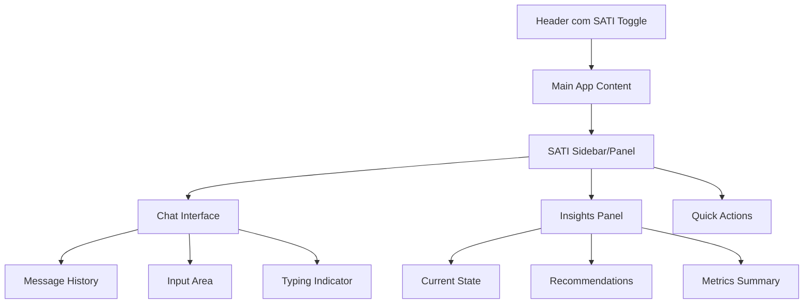

# Interface e Experiência do Usuário - SATI

## Objetivo
Criar uma interface intuitiva e envolvente para interação com o SATI, integrada harmoniosamente ao StayFocus.

## Arquitetura da Interface

### 1. Layout Principal


## Componentes da Interface

### 1. SATI Main Container
```typescript
// src/components/SATI/SATIContainer.tsx
import React, { useState, useEffect } from 'react';
import { SATIChat } from './SATIChat';
import { InsightsPanel } from './InsightsPanel';
import { QuickActions } from './QuickActions';
import { SATIService } from '../../services/satiService';
import { useAuth } from '../../hooks/useAuth';
import { useSettings } from '../../hooks/useSettings';

export interface SATIContainerProps {
  isOpen: boolean;
  onClose: () => void;
  defaultTab?: 'chat' | 'insights' | 'actions';
}

export function SATIContainer({ isOpen, onClose, defaultTab = 'chat' }: SATIContainerProps) {
  const [activeTab, setActiveTab] = useState(defaultTab);
  const [satiEnabled, setSatiEnabled] = useState(true);
  const [loading, setLoading] = useState(false);
  
  const { user } = useAuth();
  const { settings, updateSetting } = useSettings();
  const satiService = new SATIService();

  useEffect(() => {
    if (settings?.sati_enabled !== undefined) {
      setSatiEnabled(settings.sati_enabled);
    }
  }, [settings]);

  const handleToggleSATI = async () => {
    try {
      setLoading(true);
      await updateSetting('sati_enabled', !satiEnabled);
      setSatiEnabled(!satiEnabled);
    } catch (error) {
      console.error('Erro ao toggle SATI:', error);
    } finally {
      setLoading(false);
    }
  };

  if (!isOpen) return null;

  return (
    <div className="sati-container">
      <div className="sati-overlay" onClick={onClose} />
      
      <div className="sati-panel">
        <header className="sati-header">
          <div className="sati-title">
            <div className="sati-avatar">
              
            </div>
            <div className="sati-info">
              <h2>SATI</h2>
              <p>Seu Assistente de Produtividade</p>
            </div>
          </div>
          
          <div className="sati-controls">
            <button 
              className={`toggle-btn ${satiEnabled ? 'enabled' : 'disabled'}`}
              onClick={handleToggleSATI}
              disabled={loading}
            >
              {satiEnabled ? 'Ativo' : 'Inativo'}
            </button>
            
            <button className="close-btn" onClick={onClose}>
              ✕
            </button>
          </div>
        </header>

        {satiEnabled ? (
          <>
            <nav className="sati-tabs">
              <button 
                className={`tab ${activeTab === 'chat' ? 'active' : ''}`}
                onClick={() => setActiveTab('chat')}
              >
                💬 Chat
              </button>
              <button 
                className={`tab ${activeTab === 'insights' ? 'active' : ''}`}
                onClick={() => setActiveTab('insights')}
              >
                📊 Insights
              </button>
              <button 
                className={`tab ${activeTab === 'actions' ? 'active' : ''}`}
                onClick={() => setActiveTab('actions')}
              >
                ⚡ Ações
              </button>
            </nav>

            <div className="sati-content">
              {activeTab === 'chat' && <SATIChat userId={user?.id || ''} />}
              {activeTab === 'insights' && <InsightsPanel userId={user?.id || ''} />}
              {activeTab === 'actions' && <QuickActions userId={user?.id || ''} />}
            </div>
          </>
        ) : (
          <div className="sati-disabled">
            <div className="disabled-message">
              <h3>SATI está desativado</h3>
              <p>Ative o SATI para receber assistência inteligente com sua produtividade.</p>
              <button onClick={handleToggleSATI} className="enable-btn">
                Ativar SATI
              </button>
            </div>
          </div>
        )}
      </div>
    </div>
  );
}
```

### 2. Chat Interface Avançada
```typescript
// src/components/SATI/SATIChat.tsx
import React, { useState, useEffect, useRef } from 'react';
import { SATIService, SATIMessage } from '../../services/satiService';
import { MessageBubble } from './MessageBubble';
import { TypingIndicator } from './TypingIndicator';
import { SuggestionChips } from './SuggestionChips';

export interface SATIChatProps {
  userId: string;
}

export function SATIChat({ userId }: SATIChatProps) {
  const [messages, setMessages] = useState<SATIMessage[]>([]);
  const [input, setInput] = useState('');
  const [loading, setLoading] = useState(false);
  const [sessionId] = useState(() => `session_${Date.now()}`);
  const [suggestions, setSuggestions] = useState<string[]>([]);
  
  const messagesEndRef = useRef<HTMLDivElement>(null);
  const inputRef = useRef<HTMLInputElement>(null);
  const satiService = new SATIService();

  useEffect(() => {
    loadChatHistory();
    generateInitialSuggestions();
  }, [userId]);

  useEffect(() => {
    scrollToBottom();
  }, [messages]);

  const loadChatHistory = async () => {
    try {
      // Carregar histórico recente de mensagens
      const history = await satiService.getChatHistory(userId, sessionId);
      setMessages(history);
    } catch (error) {
      console.error('Erro ao carregar histórico:', error);
    }
  };

  const generateInitialSuggestions = async () => {
    try {
      const contextSuggestions = await satiService.generateContextualSuggestions(userId);
      setSuggestions(contextSuggestions);
    } catch (error) {
      console.error('Erro ao gerar sugestões:', error);
    }
  };

  const sendMessage = async (text?: string) => {
    const messageText = text || input.trim();
    if (!messageText || loading) return;

    const userMessage: SATIMessage = {
      id: `msg_${Date.now()}`,
      type: 'user',
      content: messageText,
      timestamp: new Date()
    };

    setMessages(prev => [...prev, userMessage]);
    setInput('');
    setLoading(true);
    setSuggestions([]);

    try {
      const response = await satiService.processMessage(messageText, userId, sessionId);
      setMessages(prev => [...prev, response]);
      
      // Gerar novas sugestões baseadas na resposta
      const newSuggestions = await satiService.generateFollowUpSuggestions(response, userId);
      setSuggestions(newSuggestions);
    } catch (error) {
      console.error('Erro ao enviar mensagem:', error);
      
      const errorMessage: SATIMessage = {
        id: `error_${Date.now()}`,
        type: 'assistant',
        content: 'Desculpe, houve um erro. Tente novamente em alguns instantes.',
        timestamp: new Date(),
        metadata: { confidence: 0 }
      };
      
      setMessages(prev => [...prev, errorMessage]);
    } finally {
      setLoading(false);
    }
  };

  const handleKeyPress = (e: React.KeyboardEvent) => {
    if (e.key === 'Enter' && !e.shiftKey) {
      e.preventDefault();
      sendMessage();
    }
  };

  const handleSuggestionClick = (suggestion: string) => {
    sendMessage(suggestion);
  };

  const scrollToBottom = () => {
    messagesEndRef.current?.scrollIntoView({ behavior: 'smooth' });
  };

  const clearChat = () => {
    setMessages([]);
    setSuggestions([]);
    generateInitialSuggestions();
  };

  return (
    <div className="sati-chat">
      <div className="chat-header">
        <h3>Conversa com SATI</h3>
        <button onClick={clearChat} className="clear-btn" title="Limpar conversa">
          🗑️
        </button>
      </div>

      <div className="messages-container">
        {messages.length === 0 ? (
          <div className="welcome-message">
            <div className="welcome-content">
              <h4>👋 Olá! Sou o SATI</h4>
              <p>Estou aqui para ajudar você a ser mais produtivo. Pergunte-me sobre:</p>
              <ul>
                <li>• Análise da sua produtividade</li>
                <li>• Sugestões de técnicas Pomodoro</li>
                <li>• Organização de tarefas</li>
                <li>• Dicas personalizadas</li>
              </ul>
            </div>
          </div>
        ) : (
          messages.map(message => (
            <MessageBubble key={message.id} message={message} />
          ))
        )}
        
        {loading && <TypingIndicator />}
        <div ref={messagesEndRef} />
      </div>

      {suggestions.length > 0 && (
        <SuggestionChips 
          suggestions={suggestions}
          onSuggestionClick={handleSuggestionClick}
        />
      )}

      <div className="input-area">
        <div className="input-container">
          <input
            ref={inputRef}
            type="text"
            value={input}
            onChange={(e) => setInput(e.target.value)}
            onKeyPress={handleKeyPress}
            placeholder="Digite sua pergunta ou peça uma sugestão..."
            disabled={loading}
            className="message-input"
          />
          
          <button 
            onClick={() => sendMessage()}
            disabled={loading || !input.trim()}
            className="send-btn"
          >
            {loading ? '⏳' : '📤'}
          </button>
        </div>
        
        <div className="input-hints">
          <span>Pressione Enter para enviar, Shift+Enter para nova linha</span>
        </div>
      </div>
    </div>
  );
}
```

### 3. Message Bubble Component
```typescript
// src/components/SATI/MessageBubble.tsx
import React, { useState } from 'react';
import { SATIMessage } from '../../services/satiService';

export interface MessageBubbleProps {
  message: SATIMessage;
}

export function MessageBubble({ message }: MessageBubbleProps) {
  const [showFeedback, setShowFeedback] = useState(false);
  const [feedback, setFeedback] = useState<number | null>(null);

  const handleFeedback = async (rating: number) => {
    setFeedback(rating);
    // Enviar feedback para o backend
    try {
      await fetch('/api/sati/feedback', {
        method: 'POST',
        headers: { 'Content-Type': 'application/json' },
        body: JSON.stringify({
          messageId: message.id,
          rating,
          timestamp: new Date().toISOString()
        })
      });
    } catch (error) {
      console.error('Erro ao enviar feedback:', error);
    }
  };

  const formatTimestamp = (date: Date) => {
    return date.toLocaleTimeString('pt-BR', { 
      hour: '2-digit', 
      minute: '2-digit' 
    });
  };

  const getConfidenceIndicator = (confidence?: number) => {
    if (!confidence) return '';
    
    if (confidence >= 0.8) return '🟢';
    if (confidence >= 0.6) return '🟡';
    return '🔴';
  };

  return (
    <div className={`message-bubble ${message.type}`}>
      <div className="message-content">
        {message.type === 'assistant' && (
          <div className="assistant-avatar">
            
          </div>
        )}
        
        <div className="message-body">
          <div className="message-text">
            {message.content}
          </div>
          
          {message.metadata?.sources && message.metadata.sources.length > 0 && (
            <div className="message-sources">
              <details>
                <summary>Fontes utilizadas</summary>
                <ul>
                  {message.metadata.sources.map((source, index) => (
                    <li key={index}>{source}</li>
                  ))}
                </ul>
              </details>
            </div>
          )}
          
          <div className="message-footer">
            <span className="timestamp">
              {formatTimestamp(message.timestamp)}
            </span>
            
            {message.metadata?.confidence && (
              <span className="confidence" title={`Confiança: ${Math.round(message.metadata.confidence * 100)}%`}>
                {getConfidenceIndicator(message.metadata.confidence)}
              </span>
            )}
            
            {message.type === 'assistant' && (
              <div className="message-actions">
                <button 
                  onClick={() => setShowFeedback(!showFeedback)}
                  className="feedback-btn"
                  title="Avaliar resposta"
                >
                  👍👎
                </button>
              </div>
            )}
          </div>
          
          {showFeedback && message.type === 'assistant' && (
            <div className="feedback-panel">
              <p>Esta resposta foi útil?</p>
              <div className="feedback-buttons">
                {[1, 2, 3, 4, 5].map(rating => (
                  <button
                    key={rating}
                    onClick={() => handleFeedback(rating)}
                    className={`feedback-rating ${feedback === rating ? 'selected' : ''}`}
                  >
                    {'⭐'.repeat(rating)}
                  </button>
                ))}
              </div>
            </div>
          )}
        </div>
      </div>
    </div>
  );
}
```

### 4. Quick Actions Panel
```typescript
// src/components/SATI/QuickActions.tsx
import React, { useState, useEffect } from 'react';
import { SATIService } from '../../services/satiService';

export interface QuickActionsProps {
  userId: string;
}

export function QuickActions({ userId }: QuickActionsProps) {
  const [actions, setActions] = useState<any[]>([]);
  const [loading, setLoading] = useState(false);
  
  const satiService = new SATIService();

  useEffect(() => {
    loadQuickActions();
  }, [userId]);

  const loadQuickActions = async () => {
    try {
      setLoading(true);
      const contextualActions = await satiService.generateQuickActions(userId);
      setActions(contextualActions);
    } catch (error) {
      console.error('Erro ao carregar ações rápidas:', error);
    } finally {
      setLoading(false);
    }
  };

  const executeAction = async (action: any) => {
    try {
      setLoading(true);
      await satiService.executeQuickAction(action.id, userId);
      
      // Recarregar ações após execução
      await loadQuickActions();
    } catch (error) {
      console.error('Erro ao executar ação:', error);
    } finally {
      setLoading(false);
    }
  };

  if (loading && actions.length === 0) {
    return <div className="loading">Carregando ações...</div>;
  }

  return (
    <div className="quick-actions">
      <div className="actions-header">
        <h3>Ações Rápidas</h3>
        <button onClick={loadQuickActions} className="refresh-btn">
          🔄
        </button>
      </div>

      <div className="actions-grid">
        {actions.map(action => (
          <div key={action.id} className="action-card">
            <div className="action-icon">
              {action.icon}
            </div>
            
            <div className="action-content">
              <h4>{action.title}</h4>
              <p>{action.description}</p>
              
              {action.metadata?.impact && (
                <div className="action-impact">
                  Impacto: {action.metadata.impact}
                </div>
              )}
            </div>
            
            <button 
              onClick={() => executeAction(action)}
              disabled={loading}
              className="action-btn"
            >
              {action.buttonText || 'Executar'}
            </button>
          </div>
        ))}
      </div>

      {actions.length === 0 && !loading && (
        <div className="no-actions">
          <p>Nenhuma ação rápida disponível no momento.</p>
          <p>Continue usando o StayFocus para que eu possa sugerir ações personalizadas!</p>
        </div>
      )}
    </div>
  );
}
```

### 5. Proactive Suggestions
```typescript
// src/components/SATI/ProactiveSuggestions.tsx
import React, { useState, useEffect } from 'react';
import { SATIService, SATIMessage } from '../../services/satiService';

export interface ProactiveSuggestionsProps {
  userId: string;
  onSuggestionAccepted?: (suggestion: SATIMessage) => void;
}

export function ProactiveSuggestions({ userId, onSuggestionAccepted }: ProactiveSuggestionsProps) {
  const [suggestion, setSuggestion] = useState<SATIMessage | null>(null);
  const [dismissed, setDismissed] = useState<Set<string>>(new Set());
  
  const satiService = new SATIService();

  useEffect(() => {
    const checkForSuggestions = async () => {
      try {
        const proactiveSuggestion = await satiService.generateProactiveSuggestion(userId);
        
        if (proactiveSuggestion && !dismissed.has(proactiveSuggestion.id)) {
          setSuggestion(proactiveSuggestion);
        }
      } catch (error) {
        console.error('Erro ao buscar sugestões proativas:', error);
      }
    };

    // Verificar sugestões a cada 5 minutos
    const interval = setInterval(checkForSuggestions, 5 * 60 * 1000);
    
    // Verificação inicial
    checkForSuggestions();

    return () => clearInterval(interval);
  }, [userId, dismissed]);

  const acceptSuggestion = () => {
    if (suggestion) {
      onSuggestionAccepted?.(suggestion);
      setSuggestion(null);
    }
  };

  const dismissSuggestion = () => {
    if (suggestion) {
      setDismissed(prev => new Set([...prev, suggestion.id]));
      setSuggestion(null);
    }
  };

  if (!suggestion) return null;

  return (
    <div className="proactive-suggestion">
      <div className="suggestion-overlay" onClick={dismissSuggestion} />
      
      <div className="suggestion-popup">
        <div className="suggestion-header">
          <div className="sati-badge">
            
            <span>SATI Sugere</span>
          </div>
          
          <button onClick={dismissSuggestion} className="close-btn">
            ✕
          </button>
        </div>
        
        <div className="suggestion-content">
          <p>{suggestion.content}</p>
        </div>
        
        <div className="suggestion-actions">
          <button onClick={dismissSuggestion} className="dismiss-btn">
            Não, obrigado
          </button>
          <button onClick={acceptSuggestion} className="accept-btn">
            Vamos conversar
          </button>
        </div>
      </div>
    </div>
  );
}
```

## Estilos CSS

```css
/* src/styles/sati.css */
.sati-container {
  position: fixed;
  top: 0;
  left: 0;
  right: 0;
  bottom: 0;
  z-index: 1000;
  display: flex;
  align-items: center;
  justify-content: flex-end;
  padding: 20px;
}

.sati-overlay {
  position: absolute;
  top: 0;
  left: 0;
  right: 0;
  bottom: 0;
  background: rgba(0, 0, 0, 0.5);
  backdrop-filter: blur(4px);
}

.sati-panel {
  position: relative;
  width: 400px;
  height: 80vh;
  max-height: 700px;
  background: white;
  border-radius: 16px;
  box-shadow: 0 20px 60px rgba(0, 0, 0, 0.3);
  display: flex;
  flex-direction: column;
  overflow: hidden;
}

.sati-header {
  display: flex;
  align-items: center;
  justify-content: space-between;
  padding: 20px;
  background: linear-gradient(135deg, #667eea 0%, #764ba2 100%);
  color: white;
}

.sati-title {
  display: flex;
  align-items: center;
  gap: 12px;
}

.sati-avatar img {
  width: 40px;
  height: 40px;
  border-radius: 50%;
}

.sati-tabs {
  display: flex;
  background: #f8f9fa;
  border-bottom: 1px solid #e9ecef;
}

.tab {
  flex: 1;
  padding: 12px;
  border: none;
  background: transparent;
  cursor: pointer;
  transition: all 0.2s;
}

.tab.active {
  background: white;
  border-bottom: 2px solid #667eea;
  color: #667eea;
}

.sati-content {
  flex: 1;
  overflow: hidden;
  display: flex;
  flex-direction: column;
}

/* Chat específico */
.sati-chat {
  height: 100%;
  display: flex;
  flex-direction: column;
}

.messages-container {
  flex: 1;
  overflow-y: auto;
  padding: 20px;
  scroll-behavior: smooth;
}

.message-bubble {
  display: flex;
  margin-bottom: 16px;
}

.message-bubble.user {
  justify-content: flex-end;
}

.message-bubble.user .message-body {
  background: #667eea;
  color: white;
  border-radius: 18px 18px 4px 18px;
}

.message-bubble.assistant .message-body {
  background: #f1f3f4;
  border-radius: 18px 18px 18px 4px;
}

.message-body {
  max-width: 80%;
  padding: 12px 16px;
  word-wrap: break-word;
}

.input-area {
  padding: 20px;
  border-top: 1px solid #e9ecef;
}

.input-container {
  display: flex;
  gap: 8px;
  align-items: flex-end;
}

.message-input {
  flex: 1;
  padding: 12px 16px;
  border: 1px solid #ddd;
  border-radius: 24px;
  outline: none;
  resize: none;
  font-family: inherit;
}

.send-btn {
  width: 44px;
  height: 44px;
  border: none;
  background: #667eea;
  color: white;
  border-radius: 50%;
  cursor: pointer;
  display: flex;
  align-items: center;
  justify-content: center;
  transition: background 0.2s;
}

.send-btn:hover:not(:disabled) {
  background: #5a6fd8;
}

.send-btn:disabled {
  opacity: 0.5;
  cursor: not-allowed;
}

/* Sugestões proativas */
.proactive-suggestion {
  position: fixed;
  top: 0;
  left: 0;
  right: 0;
  bottom: 0;
  z-index: 2000;
  display: flex;
  align-items: center;
  justify-content: center;
  padding: 20px;
}

.suggestion-popup {
  background: white;
  border-radius: 12px;
  box-shadow: 0 12px 40px rgba(0, 0, 0, 0.3);
  max-width: 400px;
  width: 100%;
  overflow: hidden;
  animation: slideIn 0.3s ease-out;
}

@keyframes slideIn {
  from {
    transform: translateY(-20px);
    opacity: 0;
  }
  to {
    transform: translateY(0);
    opacity: 1;
  }
}

.suggestion-header {
  display: flex;
  align-items: center;
  justify-content: space-between;
  padding: 16px 20px;
  background: linear-gradient(135deg, #667eea 0%, #764ba2 100%);
  color: white;
}

.sati-badge {
  display: flex;
  align-items: center;
  gap: 8px;
  font-weight: 600;
}

.sati-badge img {
  width: 24px;
  height: 24px;
  border-radius: 50%;
}

.suggestion-content {
  padding: 20px;
}

.suggestion-actions {
  display: flex;
  gap: 12px;
  padding: 0 20px 20px;
}

.dismiss-btn {
  flex: 1;
  padding: 10px;
  border: 1px solid #ddd;
  background: white;
  border-radius: 8px;
  cursor: pointer;
}

.accept-btn {
  flex: 1;
  padding: 10px;
  border: none;
  background: #667eea;
  color: white;
  border-radius: 8px;
  cursor: pointer;
}

/* Responsividade */
@media (max-width: 768px) {
  .sati-panel {
    width: calc(100vw - 40px);
    height: calc(100vh - 40px);
  }
  
  .sati-container {
    padding: 20px;
    justify-content: center;
  }
}
```

## Integração com App Principal

```typescript
// src/components/Layout/Header.tsx
import React, { useState } from 'react';
import { SATIContainer } from '../SATI/SATIContainer';
import { ProactiveSuggestions } from '../SATI/ProactiveSuggestions';

export function Header() {
  const [satiOpen, setSatiOpen] = useState(false);
  const [hasNewSuggestion, setHasNewSuggestion] = useState(false);

  const handleSuggestionAccepted = () => {
    setSatiOpen(true);
    setHasNewSuggestion(false);
  };

  return (
    <header className="app-header">
      {/* Outros elementos do header */}
      
      <button 
        onClick={() => setSatiOpen(true)}
        className={`sati-toggle ${hasNewSuggestion ? 'has-notification' : ''}`}
        title="Abrir SATI"
      >
        🤖 SATI
        {hasNewSuggestion && <span className="notification-dot" />}
      </button>

      <SATIContainer 
        isOpen={satiOpen}
        onClose={() => setSatiOpen(false)}
      />

      <ProactiveSuggestions
        userId={user?.id || ''}
        onSuggestionAccepted={handleSuggestionAccepted}
      />
    </header>
  );
}
```

## Testes de Interface

```typescript
// src/tests/sati-interface.test.tsx
import { render, screen, fireEvent, waitFor } from '@testing-library/react';
import { SATIContainer } from '../components/SATI/SATIContainer';

describe('SATI Interface', () => {
  test('should render chat interface when opened', () => {
    render(<SATIContainer isOpen={true} onClose={() => {}} />);
    
    expect(screen.getByText('SATI')).toBeInTheDocument();
    expect(screen.getByPlaceholderText(/Digite sua pergunta/)).toBeInTheDocument();
  });

  test('should send message when user types and presses enter', async () => {
    render(<SATIContainer isOpen={true} onClose={() => {}} />);
    
    const input = screen.getByPlaceholderText(/Digite sua pergunta/);
    fireEvent.change(input, { target: { value: 'Como posso melhorar meu foco?' } });
    fireEvent.keyPress(input, { key: 'Enter', code: 'Enter' });

    await waitFor(() => {
      expect(screen.getByText('Como posso melhorar meu foco?')).toBeInTheDocument();
    });
  });

  test('should switch between tabs', () => {
    render(<SATIContainer isOpen={true} onClose={() => {}} />);
    
    const insightsTab = screen.getByText('📊 Insights');
    fireEvent.click(insightsTab);
    
    expect(insightsTab).toHaveClass('active');
  });
});
```
